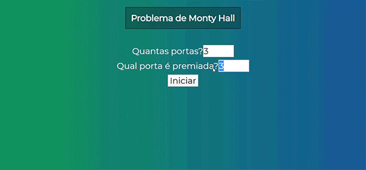

# Projeto-Paradoxo de MontyHall-VueJs
Projeto de estudo criando versão Web do problema de MontyHall usando VueJs

<a href="https://pt.wikipedia.org/wiki/Problema_de_Monty_Hall" target="_blank">Clique Para saber mais sobre o Paradoxo de MontyHall</a>

Projeto criado como parte dos estudos de VueJs no curso: <a href="https://www.udemy.com/course/curso-web/" target="blank">Web Moderno com JavaScript 2020</a>